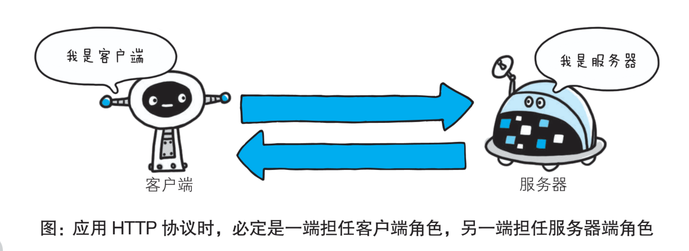
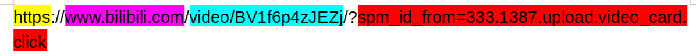
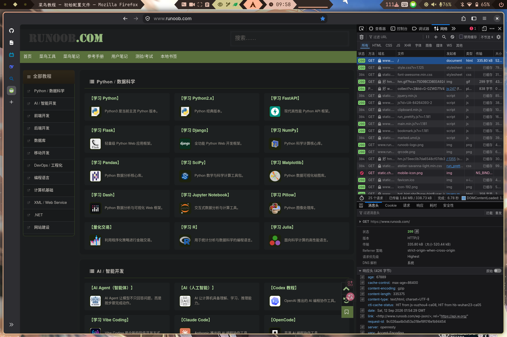
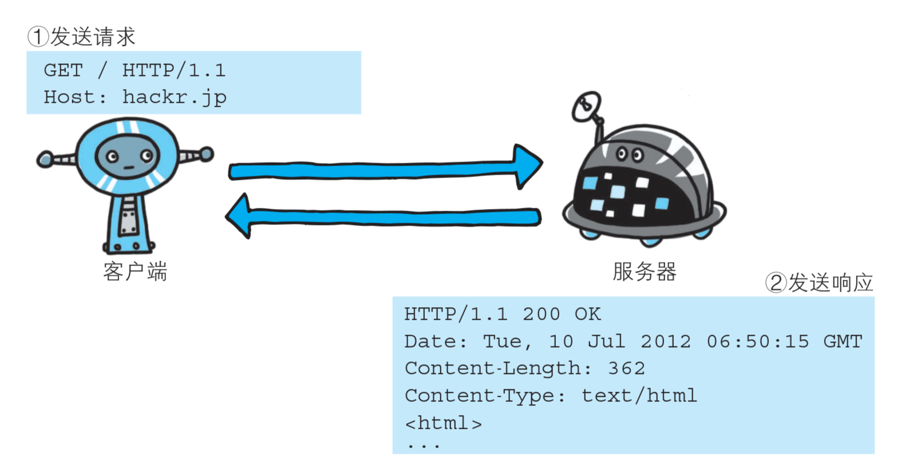
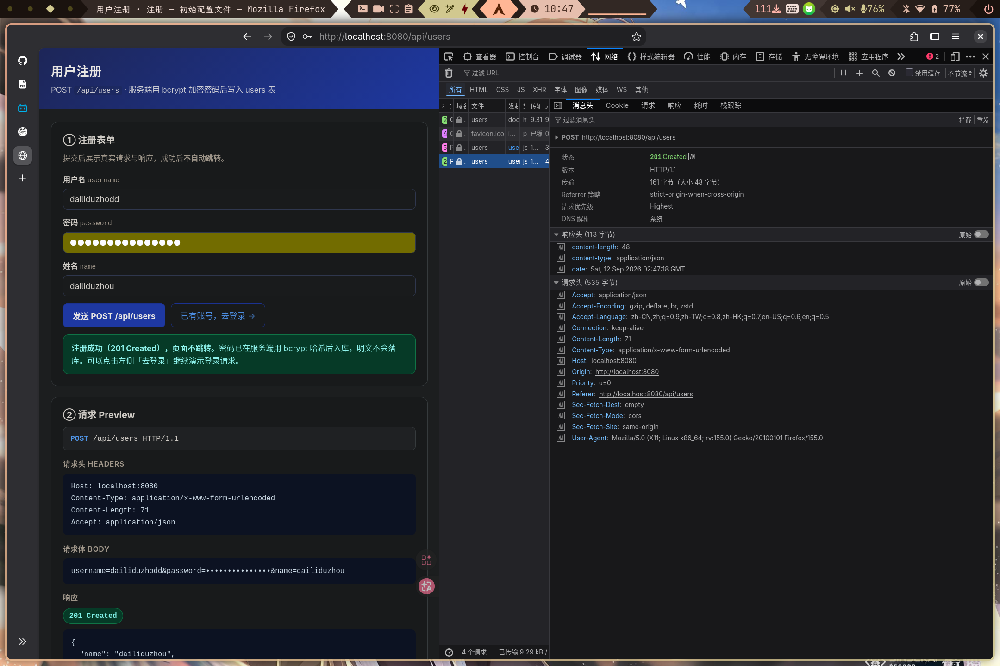
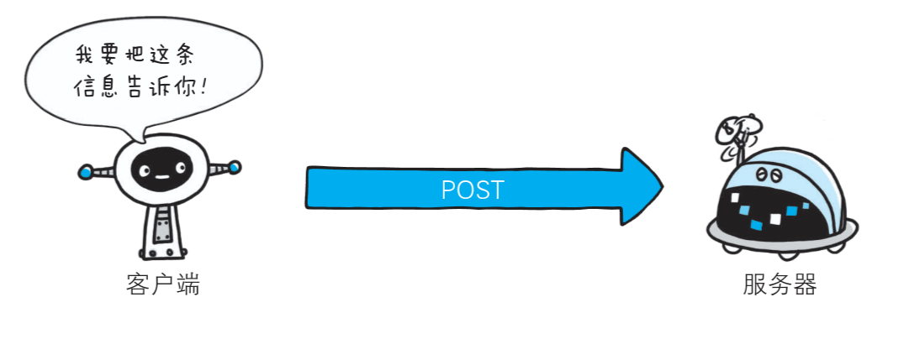
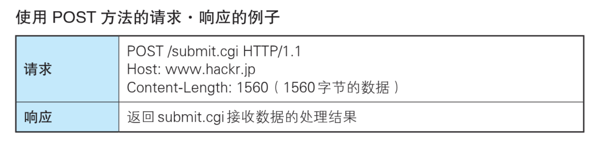
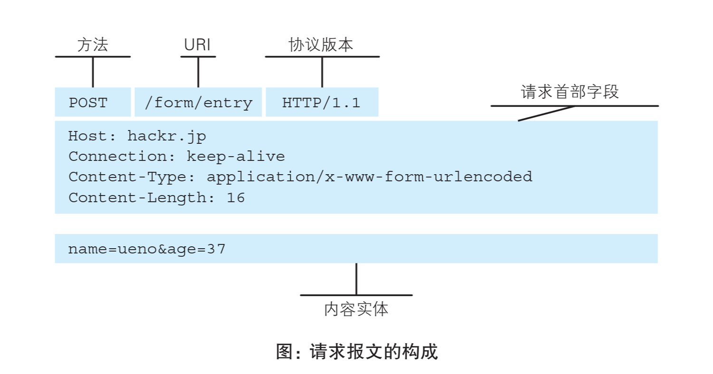
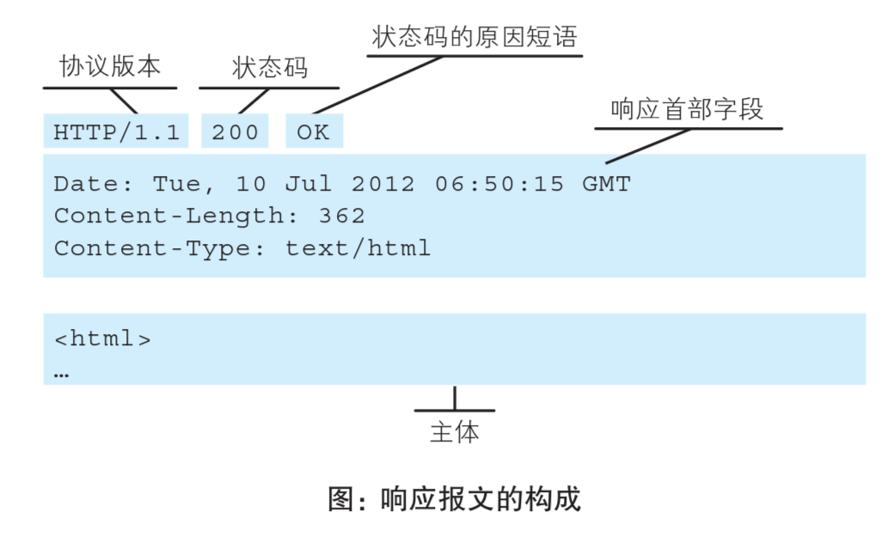

# 从`HTTP`开始的后端学习之路

## `HTTP`概念介绍。

**超文本传输协议**（英语：HyperText Transfer Protocol，缩写：`HTTP`）是一种用于分布式、协作式和超媒体信息系统的应用层协议。HTTP是万维网的数据通信的基础。


虽然概念很复杂，但`HTTP`做的事情很简单。
它定义了一整套网络传输的协议。规定了互联网中网络设备的打招呼、信息传递、结束会话的方法。使得用户访问网站，前端向后端发送请求等交互，变得可能。



接下来，我们将深入以下概念：

- `URL`
- `HTTP`状态码
- `HTTP`请求(request)
  - `HTTP`请求方法
  - `HTTP`请求头
  - `HTTP`请求体
- `HTTP`响应(response)
  - `HTTP`响应头
  - `HTTP`响应体

## `URL`

**统一资源定位符**（英语：Uniform Resource Locator，缩写：`URL`，或称统一资源定位器、定位地址、URL地址）俗称网页地址，简称网址，是因特网上标准的资源的地址（Address），如同在网络上的门牌。

`URL`的标准格式如下：
```
[协议类型]://[服务器地址]:[端口号]/[资源层级UNIX文件路径][文件名]?[查询]#[片段ID]
```



- 协议类型：`HTTPS`是`HTTP`的安全版本。
- 服务器地址：这里的`www.bilibili.com`是域名。它也可以是`192.168.1.1`这样的`IP`地址。
- 端口号：`80`是默认端口号，`443`是`HTTPS`的默认端口号。在这里并没有体现。
- 路径：`/`表示根目录，后面的`path`表示资源的路径。此处是`/vedio/BV1f6p4zJEZj`。
- 查询参数（query）：`?`后面的`spm_id_from=333.1387.upload.video_card.click`是查询参数。

无论是在互联网上获取资源，还是开发高可用性的后端服务，都离不开`URL`。

## `HTTP`状态码

**HTTP状态码**（英语：HTTP Status Code）是用以表示网页服务器超文本传输协议响应状态的3位数字代码，附带可选的英文消息短语。

他有5个类目。
| 格式 | 类别 | 内涵 |
| --- | --- | --- |
| 1xx | 信息响应 | 请求已接收，正在继续处理 |
| 2xx | 成功 | 请求已成功接收、理解并接受 |
| 3xx | 重定向 | 进一步操作需要进一步执行 |
| 4xx | 客户端错误 | 请求包含语法错误或无法完成请求 |
| 5xx | 服务器错误 | 服务器在处理请求的过程中发生了错误 |

我们以一个笑话来感性地认识一下HTTP状态码。

> 一个 HTTP 请求去相亲。
>
> 他问姑娘：“你愿意和我交往吗？”
>
> 姑娘返回：**401 Unauthorized**——“请先身份认证。”
>
> 请求赶紧带上 Cookie 和 Token，再问一次。
>
> 姑娘返回：**403 Forbidden**——“认证过了，但你没权限。”
>
> 请求不死心：“那先从朋友做起？”
>
> 姑娘返回：**301 Moved Permanently**——“我已经永久跳转到别人那儿了。”
>
> 请求崩溃：“为什么？”
>
> 姑娘返回：**418 I'm a teapot**——“因为我是个茶壶，不谈恋爱。”
>
> 请求只好返回 **404 Not Found**——心找不到了。

HTTP状态码对我们完成客户端-服务端的交互起到关键的作用。

## `HTTP` 请求

**`HTTP` 请求方法**
| 序号	|方法	|描述|
| --- | --- | --- |
 |1|	GET	|从服务器获取资源。用于请求数据而不对数据进行更改。例如，从服务器获取网页、图片等。|
 |2|	POST	|向服务器发送数据以创建新资源。常用于提交表单数据或上传文件。发送的数据包含在请求体中。|
 |3|	PUT	|向服务器发送数据以更新现有资源。如果资源不存在，则创建新的资源。与 POST 不同，PUT 通常是幂等的，即多次执行相同的 PUT 请求不会产生不同的结果。|
 |4|	DELETE	|从服务器删除指定的资源。请求中包含要删除的资源标识符。|
 |5|	PATCH	|对资源进行部分修改。与 PUT 类似，但 PATCH 只更改部分数据而不是替换整个资源。|
 |6|	HEAD	|类似于 GET，但服务器只返回响应的头部，不返回实际数据。用于检查资源的元数据（例如，检查资源是否存在，查看响应的头部信息）。|
 |7|	OPTIONS	|返回服务器支持的 HTTP 方法。用于检查服务器支持哪些请求方法，通常用于跨域资源共享（CORS）的预检请求。|
 |8|	TRACE	|回显服务器收到的请求，主要用于诊断。客户端可以查看请求在服务器中的处理路径。|
 |9|	CONNECT	|建立一个到服务器的隧道，通常用于 HTTPS 连接。客户端可以通过该隧道发送加密的数据。|

我们可以按`F12`打开开发者工具，在`网络`的页面，查看请求。





当我们访问网站主页的时候，浏览器往往会发送一个`GET`请求，以获取图形化`HTML`页面。







当我们在网页提交表单、进行账号注册、登录时，会向网站后端发送一个`POST`请求，向后端提交信息(信息的格式一般是`JSON`)。

在这里我们简要地介绍一下`JSON`。

> 什么是 JSON ？
>
>  - JSON 指的是 JavaScript 对象表示法（JavaScript Object Notation）
>  - JSON 是轻量级的文本数据交换格式
>  - JSON 独立于语言：JSON 使用 Javascript语法来描述数据对象，但是 JSON 仍然独立于语言和平台。JSON 解析器和 JSON 库支持许多不同的编程语言。 目前非常多的动态（PHP，JSP，.NET）编程语言都支持 JSON
>  - JSON 具有自我描述性，更易理解

示例如下：
```json
{
    "sites": [
    { "name":"菜鸟教程" , "url":"www.runoob.com" }, 
    { "name":"google" , "url":"www.google.com" }, 
    { "name":"微博" , "url":"www.weibo.com" }
    ]
}
```

当然除了**浏览器**之外，我们还能使用`Postman`, `APIfox`等请求发送，调试工具或者使用Go语言的`net/http`包发送HTTP请求。

在我们正式发送请求之前，我们还需要了解一些关于请求和响应的细节。

## `HTTP` 请求和响应细节





**请求首部字段**和**响应首部字段**，简称分别为**请求头**和**响应头**。

在这其中，比较重要的两个标头字段分别为`Content-Type`和`Content-Length`。
代表着请求/响应的内容类型和长度。在我们使用代码发送请求的时候，非常有用。
